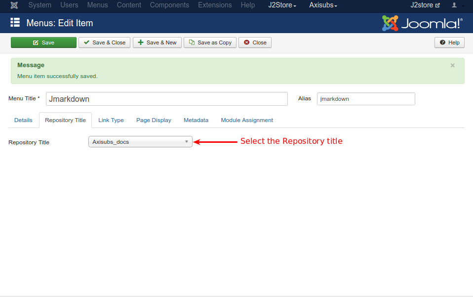
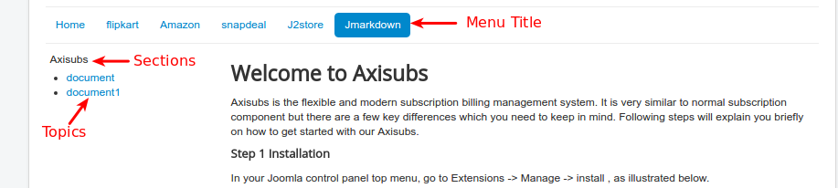

# Menu Creation

Once you have completed creating repositories, sections and topics. Now, you can display them via menu. Go to menu manager and create menu item with Menu Item Type> JMarkDown > JMarkDown Contents.

Refer the below image

Now, Enter the title for the menu.
Navigate to Repository Title tab -> Select your Repository Title from the drop down list box and save.

Check the output of JMarkDown in the front end.

