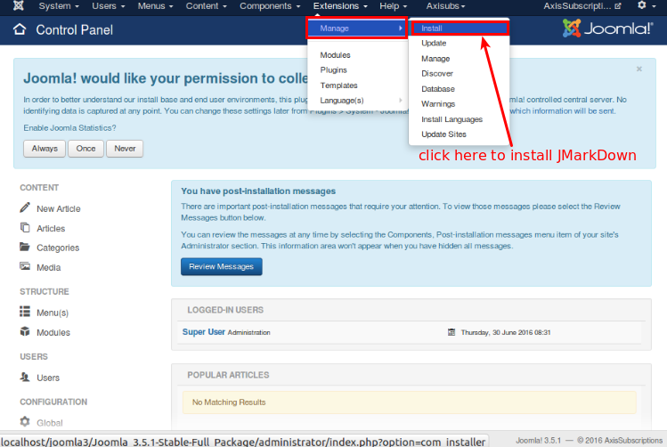
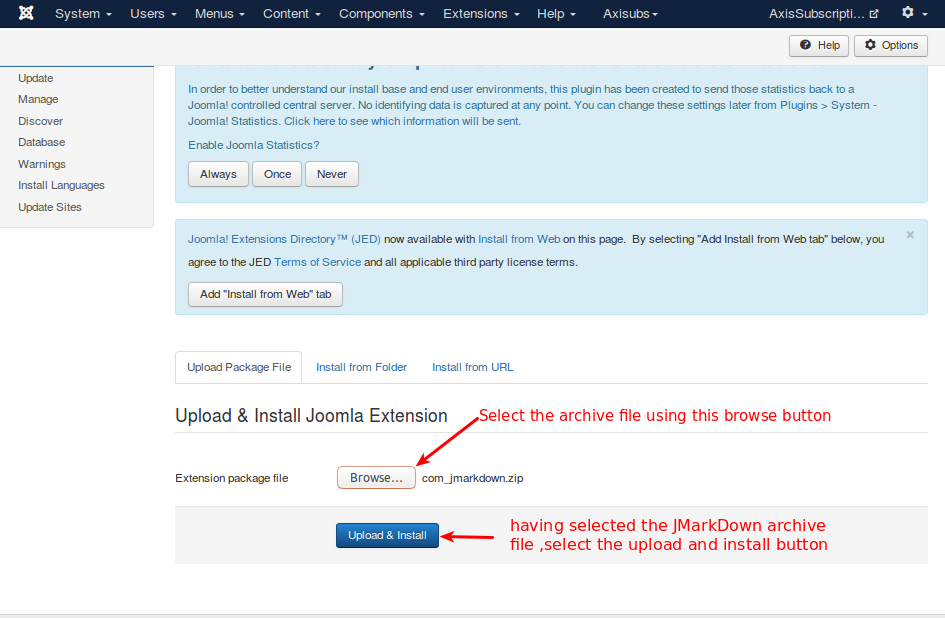
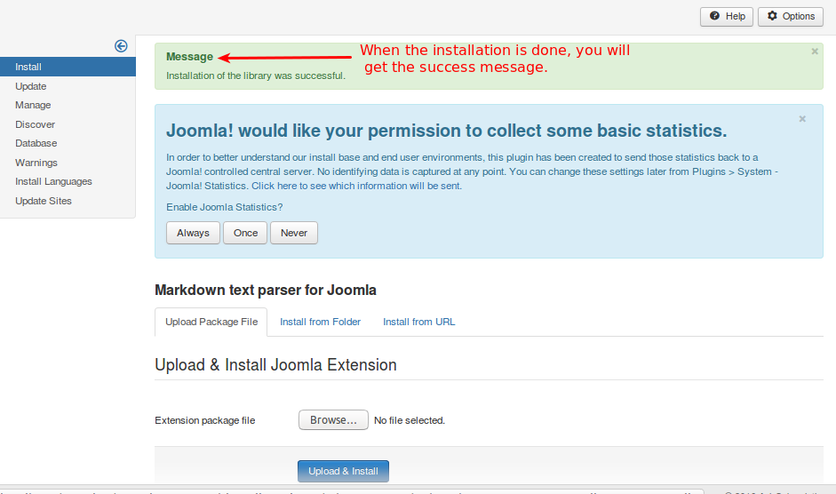

### Installation

##### Step 1
In your Joomla control panel top menu, go to Extensions -> Manage -> install as illustrated below.

##### Step 2
When you click here, you will be directed to the screen where you can select the downloaded/purchased packaged. 

See the image below:

##### Step 3
JMarkDown is now installed and you will get this success message, as illustrated below.

