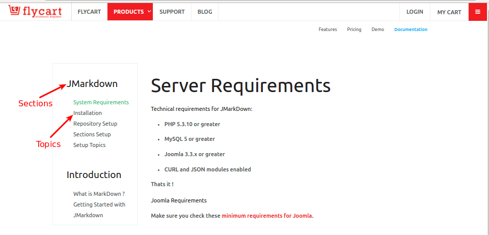

# JMarkDown

#### What is JMarkDown ?

JMarkDown is the simple and innovative Application for pick the  files from Github and displayed it into the specified site. We also use the JMarkDown for our site for Showing github files. JMarkDown has some special features for displaying files in structured format like Sections and Topics.

#### Sections

One of a number of parts that can be fitted together to make a whole documents. A sections can contain many topics.

Refer the below image you can get a better idea about JMarkDown Sections.

#### Topics

Topics are grouped into the sections. Each File inside sections are considered as topics. Each topic can contains only one single file with a .md extensions.

