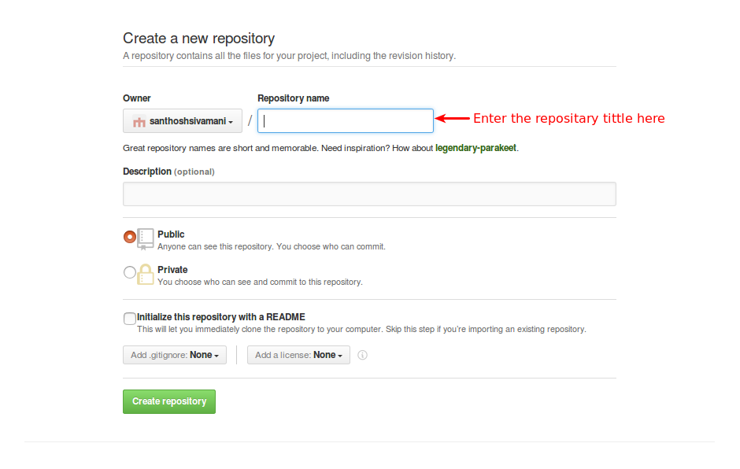
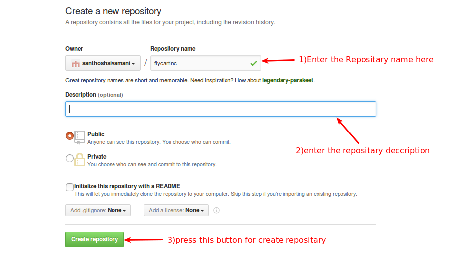
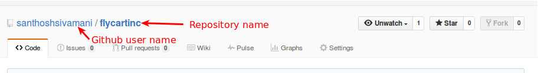
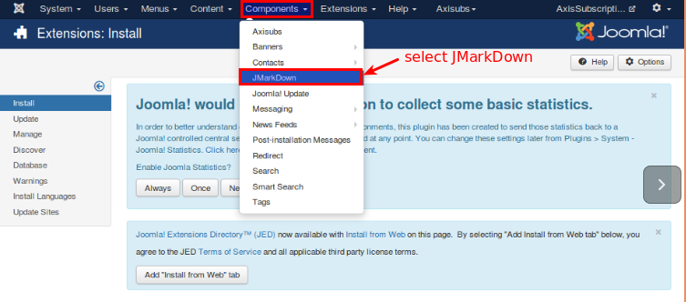
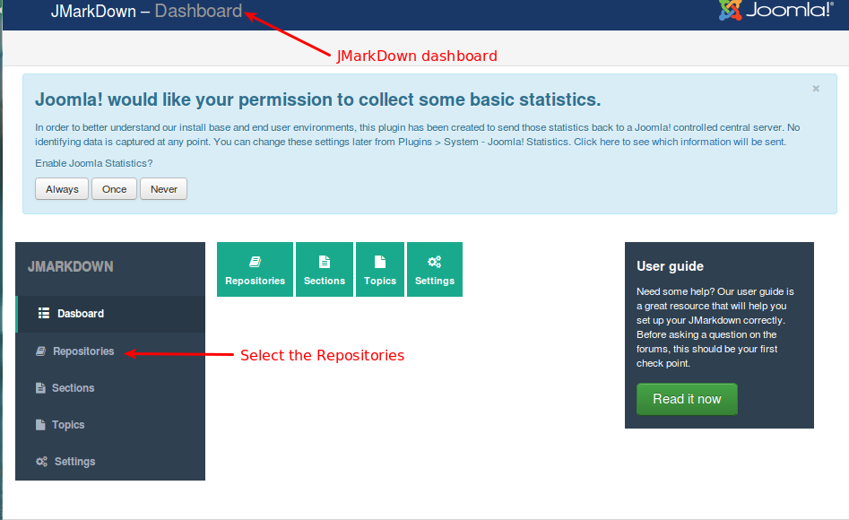
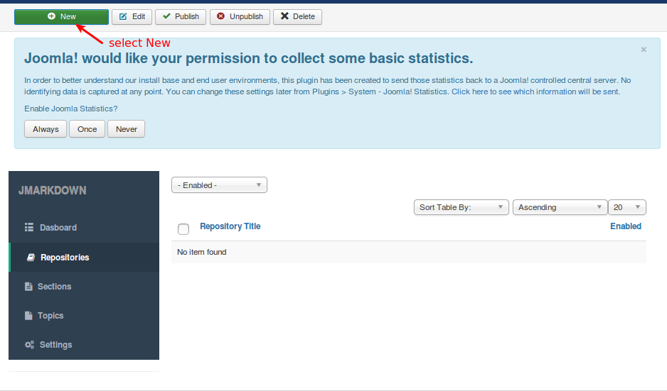
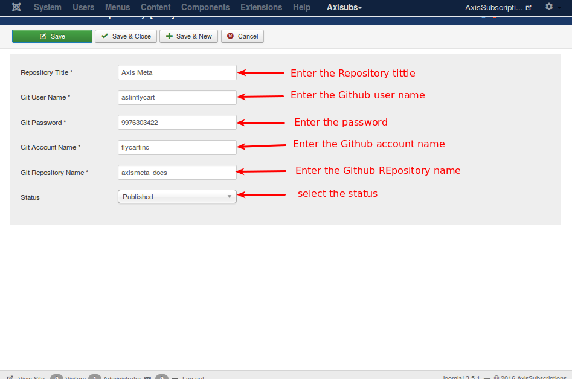

##### create Repositary

Open the Github and select new project to create new repository as like in the below image .

Enter the repository name and description(optional) after giving the necessary details press create repository button as like in the image below.

Now the repository will be created as like the below image

##### step 3 Configure the Repository

##### Repository

A repository (pronounced ree-PAHZ-ih-tor-i) is a central place in which an aggregation of data is kept and maintained in an organized way, usually in computer storage.

Go to components -> JMarkDown for getting the JMarkDown Dashboard as like below image.

Now,the Repositories will be open it does not contain any item select new button for creating/adding new Repositories.

Refer the below image

Fill all the fields with your valid repository tittle,Git user name,Git password,Git account name, Git Repository name  and select the status.
After enter all valid field press save and close.

