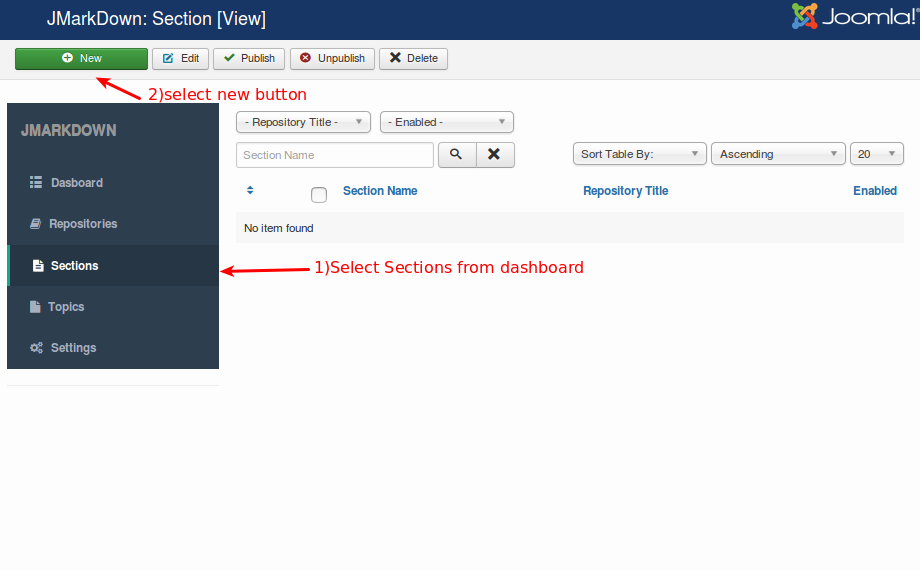
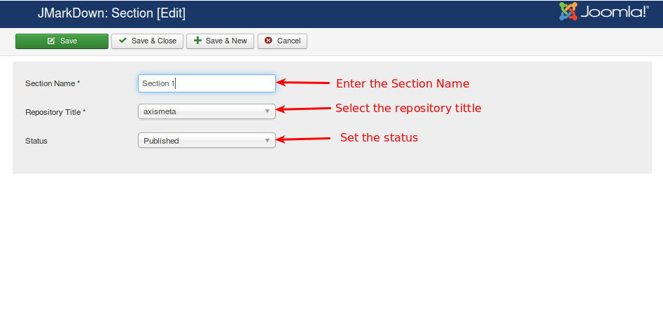

##### Sections

Select the Sections from the Dashboard

Now,the Sections will be open it does not contain any item select new button for creating/adding new Sections as like below image.

Fill all the fields with your valid Section Name,select Repository tittle name and set the status.
After enter all valid field press save and close.

Refer the below image

