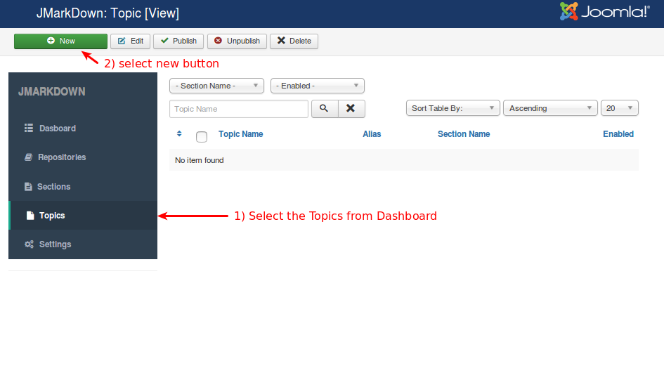
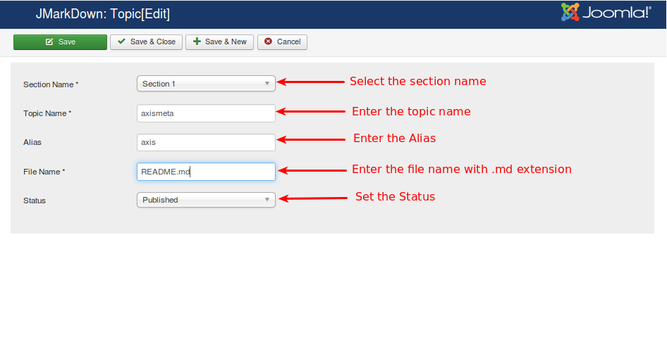

# Topics

Topics are grouped into the sections. Each File of the sections are considered as topics. Each topic also has one or more Sources where it will find the news and articles.

Select the Topics from the JMarkDown Dashboard

Currently it does not have any topics. Select new button for creating/adding new Topics as like below image.

**Section Name:** Select the section. Topics will be displayed under the section you have chosen here.

**Topic Name:** Enter the topci name. For example, Configuration.

**File Name:** Enter the name of the file with extension. File name you have entered should be matched with the file name in the Github.

**Status:** Set the status to Published.

Refer the below image

After completed all these process press save and close.

