#Getting Started

#### Welcome to JMarkDown
JMarkDown is the simple and innovative Application for picking the MarkDown files from Github.Before you Start working with JMarkDown which you need to keep in mind the Following steps will explain you briefly on how to get started with our JMarkDown.

##### Step 1 Installation
In your Joomla control panel top menu, go to Extensions -> Manage -> install as illustrated below.

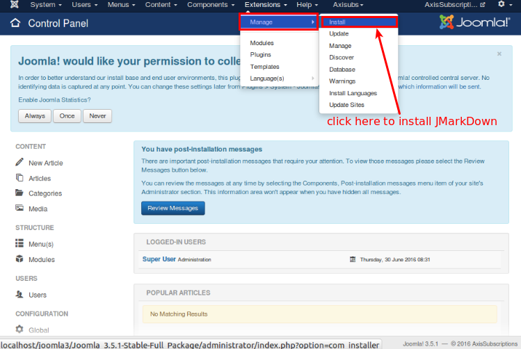

When you click here, you will be directed to the screen where you can select the downloaded/purchased packaged. 

See the image below:

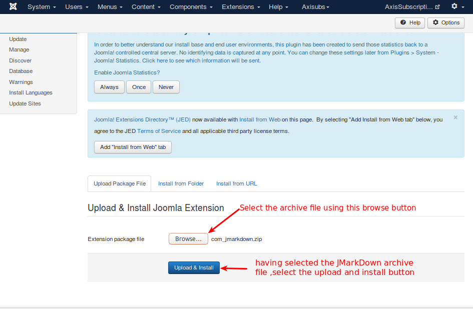

JMarkDown is now installed and you will get this success message, as illustrated below.

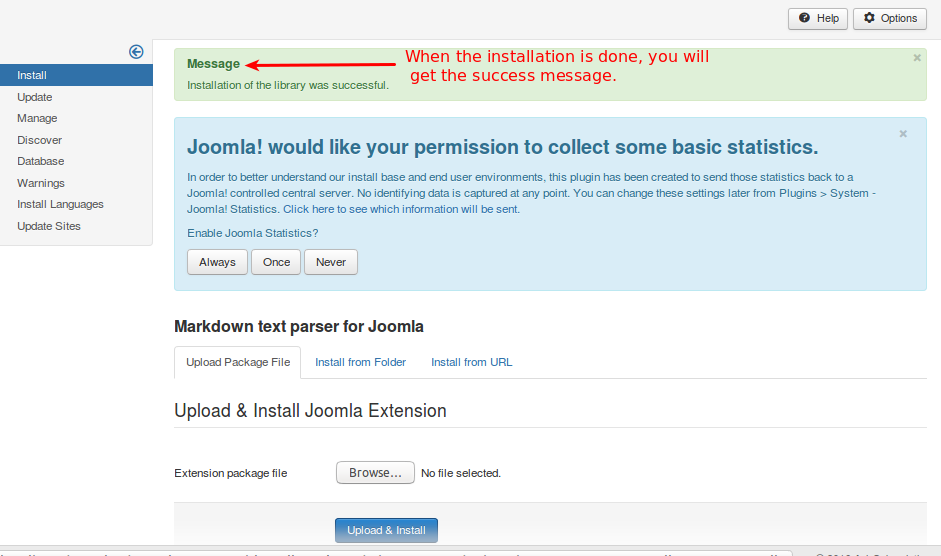

##### step 2  create Repositary

Open the Github and select new project to create new repository as like in the below image .

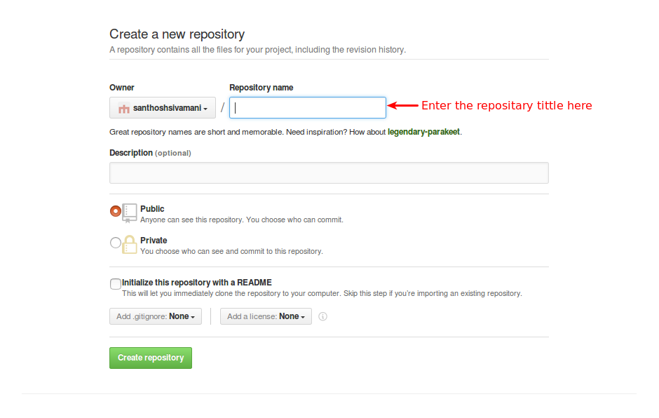

Enter the repository name and description(optional) after giving the necessary details press create repository button as like in the image below.

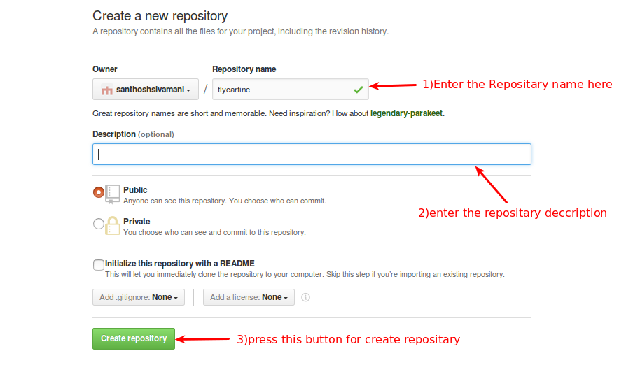

Now the repository will be created as like the below image

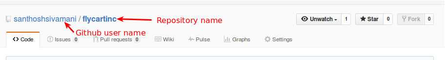

##### step 3 Configure the Repository

##### Repository

A repository (pronounced ree-PAHZ-ih-tor-i) is a central place in which an aggregation of data is kept and maintained in an organized way, usually in computer storage.

Go to components -> JMarkDown for getting the JMarkDown Dashboard as like below image.

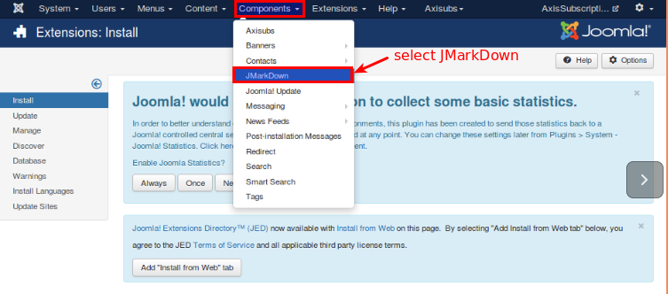

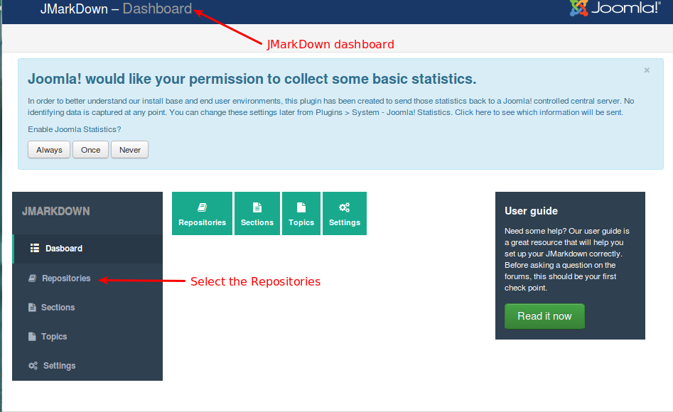

Now,the Repositories will be open it does not contain any item select new button for creating/adding new Repositories.

Refer the below image

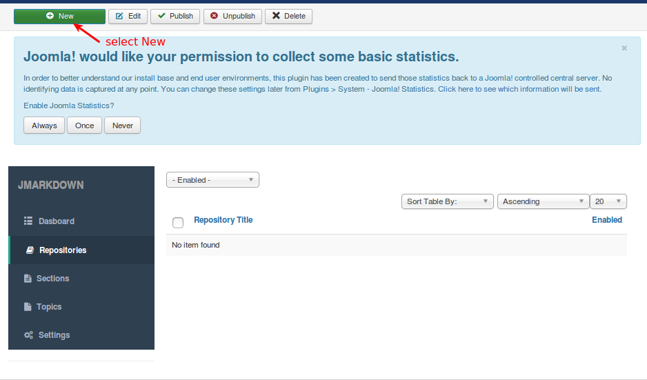

Fill all the fields with your valid repository tittle,Git user name,Git password,Git account name, Git Repository name  and select the status.
After enter all valid field press save and close.
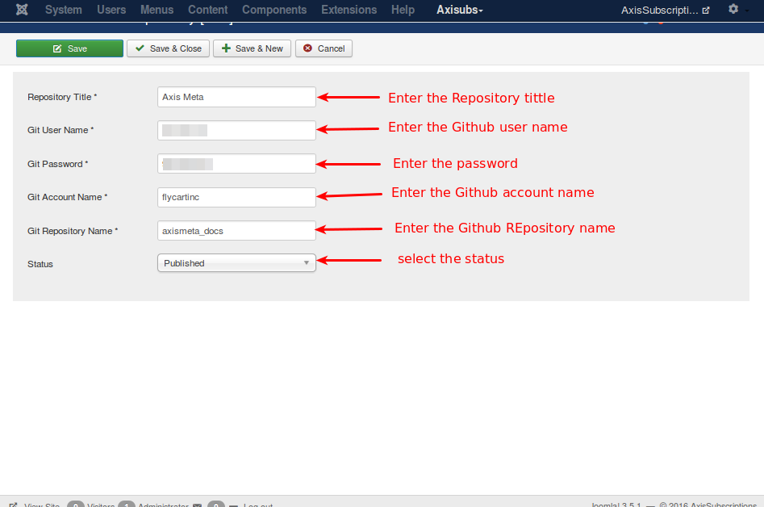

##### Step 4 Configure the Sections

Select the Sections from the Dashboard

Now,the Sections will be open it does not contain any item select new button for creating/adding new Sections as like below image.
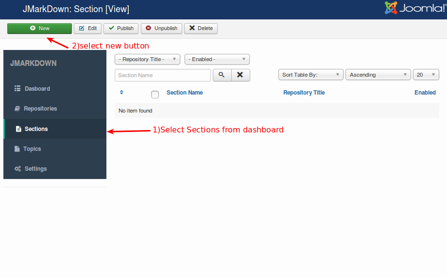

Fill all the fields with your valid Section Name,select Repository tittle name and set the status.
After enter all valid field press save and close.

Refer the below image
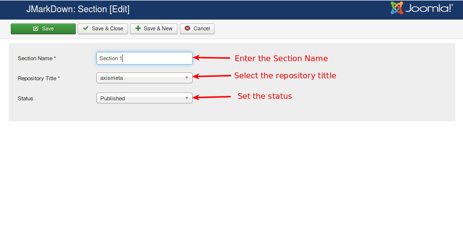

##### step 5 Configure the Topics
Select the Topics from the Dashboard

Now,the Topics will be open it does not contain any item select new button for creating/adding new Topics as like below image.

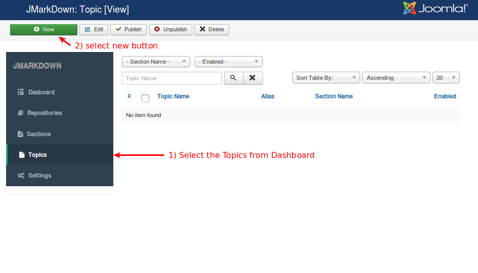
Fill all the fields with your valid Section Name,topic name, alias, enter the valid file name with .md extension and set the status.
After enter all valid field press save and close.

Refer the below image
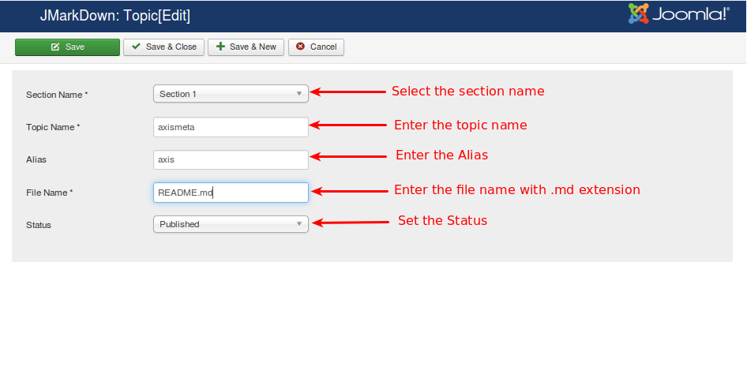

##### Display JMarkDown in Front end

Once you created the repositories, sections and topics, you can display it via menu. Go to menu manager and create menu item with mainmenu > JMarkDown > JMarkDown contents.
Refer the below image

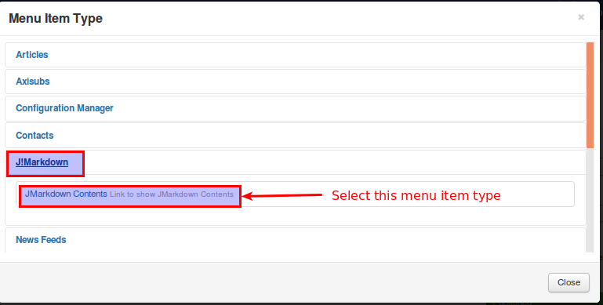

After choosing the menu item type, click the 'save' button. Once saved, go to Repository tab and select the  you have created Repository Tittle and click save and close button.

A menu item will be created in the front end with the corresponding Sectios and Topics in it.

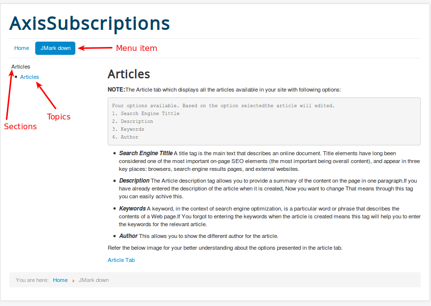
